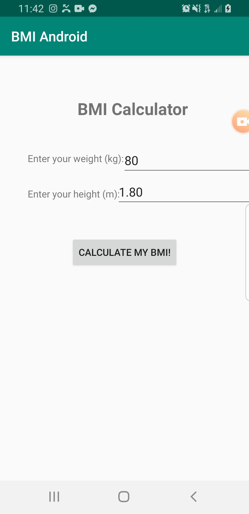

### Name
BMI en Android

### Description
Esta aplicación consiste de una calculadora la cual obtiene el indice de masa corporal de una persona, ya tiene una fórmula que debe realizar para determinar los cálculos al momento que se ingresen valores a lo que se pide y se de clic en el botón de "CALCULATE MY BMI!" y se debe mostrar en donde dice "Your BMI".

### Visuals

### Usage
Esta aplicación es para que calcule el indice de masa corporal de una persona.

### Roadmap

Mejorar el diseño de la aplicación para que se vea con mejor apariencia.

### Authors and acknowledgment

Daniela Cortez Zavala responsable de la creación de este proyecto
